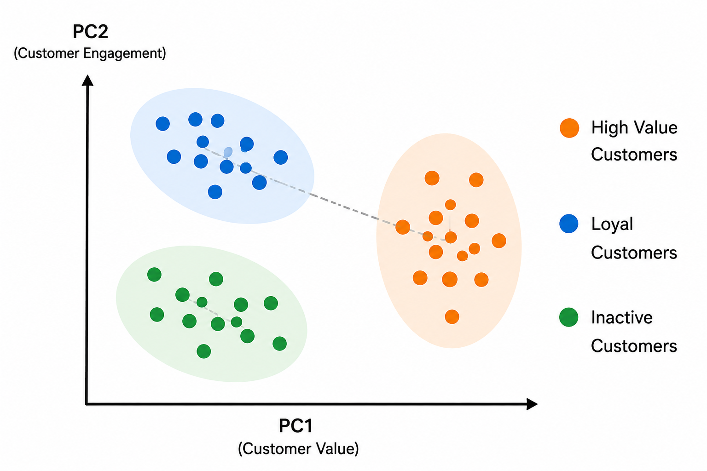

---
format:
  revealjs:
    theme: simple
    slide-number: false
    title-slide: false
    embed-resources: true
---

<style>
html, body, .reveal, .reveal-viewport, .reveal .slides, .reveal section {
  background-color: #f3efe6 !important;
}
</style>

<div style="
height:100vh;
display:flex;
flex-direction:column;
justify-content:center;
align-items:center;
text-align:center;
font-family:Helvetica, sans-serif;
color:black;
">

<div style="
font-size:64px;
font-weight:800;
line-height:1.1;
margin-bottom:45px;
max-width:1100px;
">
Using PCA for Customer Segmentation
</div>

<div style="
font-size:26px;
font-weight:500;
line-height:1.4;
margin-bottom:70px;
max-width:1000px;
">
How Principal Component Analysis Helps Simplify Marketing Data
</div>

<div style="
font-size:20px;
line-height:1.8;
">
Yunqing Zhao<br>
Marketing Analytics<br>
Spring 2026
</div>

</div>

---


```{=html}
<div style="
width:100%;
height:100%;
background:white;
font-family:Helvetica, sans-serif;
box-sizing:border-box;
padding:20px 40px 14px 40px;
overflow:hidden;
">

<!-- TITLE -->

<div style="text-align:center;">

<div style="
font-size:40px;
font-weight:800;
color:#0b2c6b;
margin-bottom:6px;
">
The Problem with Marketing Data
</div>

<div style="
font-size:19px;
color:#2453a6;
margin-bottom:10px;
">
Marketing data is complex, messy, and hard to use.
</div>

<div style="
font-size:15px;
line-height:1.35;
margin-bottom:22px;
">
Before PCA, we often deal with too many variables and noisy data, which makes it difficult to understand customers.
</div>

</div>

<!-- 3 PANELS -->

<div style="
display:grid;
grid-template-columns:1fr 1fr 1fr;
gap:20px;
width:92%;
margin:0 auto;
">

<!-- PANEL 1 -->

<div>

<div style="
background:#0b3a78;
color:white;
font-weight:700;
font-size:16px;
padding:8px;
border-radius:6px;
text-align:center;
margin-bottom:12px;
">
Too Many Variables
</div>

<div style="
background:#f7f7f7;
border-radius:12px;
padding:16px;
min-height:220px;
box-shadow:0 1px 5px rgba(0,0,0,0.08);
">

<div style="
display:flex;
flex-wrap:wrap;
gap:10px;
justify-content:center;
font-size:13px;
">

<div style="background:#53c3d1;padding:7px 16px;border-radius:7px;">Age</div>
<div style="background:#9bd35a;padding:7px 16px;border-radius:7px;">Income</div>
<div style="background:#b693f0;padding:7px 16px;border-radius:7px;">Website Visits</div>
<div style="background:#f4d44d;padding:7px 16px;border-radius:7px;">Purchase Frequency</div>
<div style="background:#a98be8;padding:7px 16px;border-radius:7px;">Ad Clicks</div>
<div style="background:#fbb347;padding:7px 16px;border-radius:7px;">Spending</div>
<div style="background:#4fc3c7;padding:7px 16px;border-radius:7px;">Session Time</div>
<div style="background:#f4d44d;padding:7px 16px;border-radius:7px;">Product Views</div>
<div style="background:#ff8fa3;padding:7px 16px;border-radius:7px;">Email Opens</div>
<div style="background:#ffa93a;padding:7px 16px;border-radius:7px;">Returns</div>
<div style="background:#ef777f;padding:7px 16px;border-radius:7px;">Location</div>
<div style="background:#b693f0;padding:7px 16px;border-radius:7px;">Loyalty Score</div>

<div>...</div>
<div>...</div>

</div>

</div>

<div style="
font-size:14px;
line-height:1.5;
margin-top:12px;
">
• Many different metrics.<br>
• Hard to decide what matters most.
</div>

</div>

<!-- PANEL 2 -->

<div>

<div style="
background:#0b3a78;
color:white;
font-weight:700;
font-size:16px;
padding:8px;
border-radius:6px;
text-align:center;
margin-bottom:12px;
">
Highly Correlated
</div>

<div style="
background:#f7f7f7;
border-radius:12px;
padding:16px;
min-height:220px;
box-shadow:0 1px 5px rgba(0,0,0,0.08);
display:flex;
align-items:center;
justify-content:center;
">

<div style="
display:grid;
grid-template-columns:repeat(6,32px);
grid-template-rows:repeat(6,32px);
gap:3px;
">

<div style="background:#e84d4d;"></div><div style="background:#f19a9a;"></div><div style="background:#e6edf8;"></div><div style="background:#c8d7ef;"></div><div style="background:#cad8ef;"></div><div style="background:#cbd9ef;"></div>

<div style="background:#f19a9a;"></div><div style="background:#e84d4d;"></div><div style="background:#f3b8b8;"></div><div style="background:#9fb9df;"></div><div style="background:#d3dceb;"></div><div style="background:#c3d2ea;"></div>

<div style="background:#d0def0;"></div><div style="background:#f4b8b8;"></div><div style="background:#e84d4d;"></div><div style="background:#7ea0d2;"></div><div style="background:#eee3e3;"></div><div style="background:#a4bbdf;"></div>

<div style="background:#a3bbdf;"></div><div style="background:#9db8df;"></div><div style="background:#8aa8d7;"></div><div style="background:#e84d4d;"></div><div style="background:#f3c6c6;"></div><div style="background:#c99bd8;"></div>

<div style="background:#cddbef;"></div><div style="background:#cbd9ef;"></div><div style="background:#cedbef;"></div><div style="background:#f3c6c6;"></div><div style="background:#e84d4d;"></div><div style="background:#f0caca;"></div>

<div style="background:#a9c0e1;"></div><div style="background:#c8d7ee;"></div><div style="background:#a8bee0;"></div><div style="background:#c99bd8;"></div><div style="background:#f0caca;"></div><div style="background:#e84d4d;"></div>

</div>

</div>

<div style="
font-size:14px;
line-height:1.5;
margin-top:12px;
">
• Many variables move together.<br>
• Redundant information adds noise.
</div>

</div>

<!-- PANEL 3 -->

<div>

<div style="
background:#0b3a78;
color:white;
font-weight:700;
font-size:16px;
padding:8px;
border-radius:6px;
text-align:center;
margin-bottom:12px;
">
Hard to Visualize
</div>

<div style="
background:#f7f7f7;
border-radius:12px;
padding:16px;
min-height:220px;
box-shadow:0 1px 5px rgba(0,0,0,0.08);
display:flex;
flex-direction:column;
align-items:center;
justify-content:center;
">

<div style="
font-size:64px;
line-height:1;
">
📊 📈
</div>

<div style="
font-size:64px;
line-height:1;
">
😟
</div>

</div>

<div style="
font-size:14px;
line-height:1.5;
margin-top:12px;
">
• Too much data to interpret.<br>
• Hard to see customer patterns.
</div>

</div>

</div>

<!-- BOTTOM BOX -->

<div style="
margin:16px auto 0 auto;
width:88%;
background:#eaf4ff;
border-radius:14px;
padding:14px 22px;
display:grid;
grid-template-columns:62px 1fr;
align-items:center;
gap:16px;
box-sizing:border-box;
">

<div style="
width:54px;
height:54px;
border-radius:50%;
background:#1b56c4;
display:flex;
align-items:center;
justify-content:center;
font-size:28px;
color:white;
">
⚠️
</div>

<div style="
font-size:18px;
line-height:1.4;
">
This is where dimension reduction techniques come in:<br>
<span style="color:#1b56c4;font-weight:800;">PCA</span> is one of the most common techniques used to reduce complexity and redundancy in high-dimensional data.
</div>

</div>

</div>
```

---


```{=html}
<div style="
width:100%;
height:100%;
background:white;
font-family:Helvetica, sans-serif;
box-sizing:border-box;
padding:26px 44px 18px 44px;
">

<div style="text-align:center;">
  <div style="font-size:42px;font-weight:800;color:#0b2c6b;margin-bottom:8px;">
    How PCA Finds New Dimensions
  </div>

  <div style="font-size:20px;color:#2453a6;margin-bottom:26px;">
    PCA rotates the data to find the most informative directions.
  </div>
</div>

<div style="
display:grid;
grid-template-columns: 1fr 90px 1fr;
align-items:start;
gap:18px;
">

<!-- LEFT -->
<div style="text-align:center;">

  <div style="
  display:inline-block;
  background:#0b3a78;
  color:white;
  font-weight:700;
  font-size:17px;
  padding:8px 22px;
  border-radius:6px;
  margin-bottom:16px;
  ">
    Original Data
  </div>

  <svg width="360" height="270" viewBox="0 0 360 270">
    <line x1="50" y1="235" x2="310" y2="235" stroke="black" stroke-width="2"/>
    <line x1="50" y1="235" x2="50" y2="35" stroke="black" stroke-width="2"/>
    <polygon points="310,235 298,228 298,242" fill="black"/>
    <polygon points="50,35 43,47 57,47" fill="black"/>

    <text x="318" y="242" font-size="15">x1</text>
    <text x="35" y="28" font-size="15">x2</text>

    <ellipse cx="165" cy="130" rx="55" ry="118"
      transform="rotate(38 165 130)"
      fill="#e8f2ff"
      stroke="#2d5ea8"
      stroke-width="2"/>

    <circle cx="115" cy="178" r="5" fill="#333"/>
    <circle cx="130" cy="162" r="5" fill="#333"/>
    <circle cx="145" cy="148" r="5" fill="#333"/>
    <circle cx="160" cy="135" r="5" fill="#333"/>
    <circle cx="176" cy="118" r="5" fill="#333"/>
    <circle cx="190" cy="103" r="5" fill="#333"/>
    <circle cx="205" cy="85" r="5" fill="#333"/>

    <circle cx="130" cy="195" r="5" fill="#333"/>
    <circle cx="150" cy="178" r="5" fill="#333"/>
    <circle cx="170" cy="160" r="5" fill="#333"/>
    <circle cx="190" cy="140" r="5" fill="#333"/>
    <circle cx="210" cy="122" r="5" fill="#333"/>

    <circle cx="105" cy="150" r="5" fill="#333"/>
    <circle cx="125" cy="138" r="5" fill="#333"/>
    <circle cx="145" cy="122" r="5" fill="#333"/>
    <circle cx="165" cy="102" r="5" fill="#333"/>
    <circle cx="185" cy="80" r="5" fill="#333"/>

    <circle cx="150" cy="208" r="5" fill="#333"/>
    <circle cx="175" cy="188" r="5" fill="#333"/>
    <circle cx="200" cy="168" r="5" fill="#333"/>
    <circle cx="225" cy="145" r="5" fill="#333"/>
  </svg>

  <div style="
  font-size:15px;
  line-height:1.35;
  text-align:left;
  margin-left:48px;
  margin-top:2px;
  ">
    Variables are correlated.<br>
    Patterns are difficult to interpret in high dimensions.
  </div>

</div>

<!-- MIDDLE -->
<div style="
text-align:center;
padding-top:165px;
">
  <div style="font-size:62px;color:#aaa;">→</div>
  <div style="font-size:20px;font-weight:700;margin-top:4px;">
    PCA<br>Rotation
  </div>
</div>

<!-- RIGHT -->
<div style="text-align:center;">

  <div style="
  display:inline-block;
  background:#0b3a78;
  color:white;
  font-weight:700;
  font-size:17px;
  padding:8px 22px;
  border-radius:6px;
  margin-bottom:16px;
  ">
    After PCA
  </div>

  <svg width="360" height="270" viewBox="0 0 360 270">
    <!-- axes -->
    <line x1="45" y1="135" x2="315" y2="135" stroke="black" stroke-width="2"/>
    <line x1="45" y1="235" x2="45" y2="35" stroke="black" stroke-width="2"/>
    <polygon points="315,135 303,128 303,142" fill="black"/>
    <polygon points="45,35 38,47 52,47" fill="black"/>

    <text x="318" y="145" font-size="15">PC1</text>
    <text x="30" y="28" font-size="15">PC2</text>

    <!-- PC1 blue arrow -->
    <line x1="80" y1="135" x2="295" y2="135" stroke="#1565c0" stroke-width="5"/>
    <polygon points="295,135 278,125 278,145" fill="#1565c0"/>

    <!-- PC2 tilted green arrow -->
    <line x1="175" y1="218" x2="190" y2="55" stroke="#2e9d50" stroke-width="4"/>
    <polygon points="190,55 178,72 200,74" fill="#2e9d50"/>

    <!-- blue dots along PC1 -->
    <circle cx="85" cy="140" r="5" fill="#1565c0"/>
    <circle cx="110" cy="131" r="5" fill="#1565c0"/>
    <circle cx="135" cy="139" r="5" fill="#1565c0"/>
    <circle cx="160" cy="132" r="5" fill="#1565c0"/>
    <circle cx="190" cy="138" r="5" fill="#1565c0"/>
    <circle cx="215" cy="131" r="5" fill="#1565c0"/>
    <circle cx="240" cy="140" r="5" fill="#1565c0"/>
    <circle cx="265" cy="133" r="5" fill="#1565c0"/>

    <!-- green dots along tilted PC2 -->
    <circle cx="177" cy="202" r="5" fill="#2e9d50"/>
    <circle cx="181" cy="183" r="5" fill="#2e9d50"/>
    <circle cx="178" cy="160" r="5" fill="#2e9d50"/>
    <circle cx="184" cy="135" r="5" fill="#2e9d50"/>
    <circle cx="183" cy="112" r="5" fill="#2e9d50"/>
    <circle cx="189" cy="90" r="5" fill="#2e9d50"/>
    <circle cx="187" cy="70" r="5" fill="#2e9d50"/>

    <!-- callouts -->
    <rect x="245" y="45" width="95" height="62" rx="8" fill="#e8f2ff" stroke="#4b80c2"/>
    <text x="292" y="68" font-size="14" text-anchor="middle">PC1 captures</text>
    <text x="292" y="87" font-size="14" text-anchor="middle">the most</text>
    <text x="292" y="104" font-size="14" text-anchor="middle">variance</text>

    <rect x="245" y="168" width="95" height="70" rx="8" fill="#edf8ed" stroke="#7bbf7b"/>
    <text x="292" y="192" font-size="14" text-anchor="middle">PC2 captures</text>
    <text x="292" y="211" font-size="14" text-anchor="middle">remaining</text>
    <text x="292" y="228" font-size="14" text-anchor="middle">variance</text>
  </svg>

</div>

</div>

<!-- BOTTOM NOTE -->
<div style="
margin:18px auto 0 auto;
width:86%;
background:#fff2d6;
border-radius:12px;
padding:14px 24px;
display:flex;
align-items:center;
gap:18px;
box-sizing:border-box;
">

<div style="
width:44px;
height:44px;
border-radius:50%;
background:#f39c12;
color:white;
font-size:26px;
font-weight:800;
display:flex;
align-items:center;
justify-content:center;
">
✓
</div>

<div style="
font-size:18px;
line-height:1.45;
color:black;
">
PCA does <b>not</b> remove data randomly.<br>
It combines correlated variables into a few new, meaningful components.
</div>

</div>

</div>
```

---


```{=html}
<div style="
width:100%;
height:100%;
background:white;
font-family:Helvetica, Arial, sans-serif;
box-sizing:border-box;
padding:22px 38px 20px 38px;
overflow:hidden;
">

<div style="text-align:center;">
  <div style="
  font-size:40px;
  font-weight:800;
  color:#0b2c6b;
  margin-bottom:7px;
  ">
    PCA for Perceptual Maps
  </div>

  <div style="
  font-size:21px;
  color:#1f66c1;
  margin-bottom:22px;
  ">
    Marketers use PCA to visualize how consumers perceive brands and products.
  </div>
</div>

<div style="
display:grid;
grid-template-columns:280px 90px 520px;
gap:22px;
align-items:center;
justify-content:center;
width:100%;
margin:0 auto;
">

<!-- LEFT PANEL -->

<div>

  <div style="
  background:#0b3a78;
  color:white;
  font-size:18px;
  font-weight:800;
  text-align:center;
  padding:10px;
  border-radius:8px;
  margin-bottom:12px;
  ">
    1. Many Attributes<br>
    <span style="font-weight:500;">
      (Hard to Visualize)
    </span>
  </div>

  <div style="
  background:#f8f8f8;
  border-radius:14px;
  padding:20px 28px;
  box-shadow:0 1px 6px rgba(0,0,0,0.08);
  font-size:20px;
  line-height:2.05;
  ">

    <div>💵 &nbsp; Price</div>
    <div>🏅 &nbsp; Quality</div>
    <div>💡 &nbsp; Innovation</div>
    <div>🛒 &nbsp; Convenience</div>
    <div>💎 &nbsp; Luxury</div>
    <div>🌿 &nbsp; Sustainability</div>

    <div style="font-size:22px;">
      ...
    </div>

  </div>

</div>

<!-- MIDDLE -->

<div style="text-align:center;">

  <div style="
  font-size:46px;
  color:#999;
  margin-bottom:8px;
  ">
    ➡
  </div>

  <div style="
  font-size:29px;
  font-weight:800;
  color:#0b2c6b;
  ">
    PCA
  </div>

</div>

<!-- RIGHT PANEL -->

<div>

  <div style="
  background:#0b3a78;
  color:white;
  font-size:18px;
  font-weight:800;
  text-align:center;
  padding:10px;
  border-radius:8px;
  margin-bottom:12px;
  ">
    2. Perceptual Map<br>
    <span style="font-weight:500;">
      (Easy to Understand)
    </span>
  </div>

  <div style="
  position:relative;
  width:520px;
  height:315px;
  background:#f8f8f8;
  border-radius:14px;
  box-shadow:0 1px 6px rgba(0,0,0,0.08);
  overflow:hidden;
  ">

    <!-- AXES -->

    <div style="
    position:absolute;
    left:58px;
    bottom:45px;
    width:420px;
    height:2px;
    background:black;
    "></div>

    <div style="
    position:absolute;
    left:58px;
    bottom:45px;
    width:2px;
    height:238px;
    background:black;
    "></div>

    <!-- ARROWS -->

    <div style="
    position:absolute;
    left:472px;
    bottom:37px;
    font-size:22px;
    ">
      ▶
    </div>

    <div style="
    position:absolute;
    left:48px;
    top:28px;
    font-size:22px;
    ">
      ▲
    </div>

    <!-- DOTTED LINES -->

    <div style="
    position:absolute;
    left:270px;
    top:56px;
    height:226px;
    border-left:2px dashed #bbb;
    "></div>

    <div style="
    position:absolute;
    left:58px;
    top:165px;
    width:420px;
    border-top:2px dashed #bbb;
    "></div>

    <!-- LABELS -->

    <div style="
    position:absolute;
    left:96px;
    top:18px;
    font-size:16px;
    text-align:center;
    font-weight:700;
    ">
      PC2<br>
      <span style="
      font-size:13px;
      font-weight:400;
      ">
        (Premium Perception)
      </span>
    </div>

    <div style="
    position:absolute;
    right:20px;
    top:172px;
    font-size:17px;
    font-weight:700;
    ">
      PC1<br>
      <span style="
      font-size:14px;
      font-weight:400;
      ">
        (Value)
      </span>
    </div>

    <!-- APPLE -->

    <div style="
    position:absolute;
    left:165px;
    top:95px;
    font-size:22px;
    color:black;
    ">
      ●
    </div>

    <div style="
    position:absolute;
    left:193px;
    top:101px;
    font-size:17px;
    ">
      brand 1
    </div>

    <!-- TESLA -->

    <div style="
    position:absolute;
    left:360px;
    top:67px;
    color:#d71920;
    font-size:22px;
    ">
      ●
    </div>

    <div style="
    position:absolute;
    left:390px;
    top:73px;
    font-size:17px;
    ">
      brand 2
    </div>

    <!-- SAMSUNG -->

    <div style="
    position:absolute;
    left:365px;
    top:138px;
    color:#0046ad;
    font-size:22px;
    ">
      ●
    </div>

    <div style="
    position:absolute;
    left:395px;
    top:144px;
    font-size:17px;
    font-weight:700;
    color:#0046ad;
    ">
      brand 3
    </div>

    <!-- NIKE -->

    <div style="
    position:absolute;
    left:135px;
    top:196px;
    color:green;
    font-size:22px;
    ">
      ●
    </div>

    <div style="
    position:absolute;
    left:165px;
    top:202px;
    font-size:17px;
    ">
      brand 4
    </div>

    <!-- TOYOTA -->

    <div style="
    position:absolute;
    left:355px;
    top:230px;
    color:#777;
    font-size:22px;
    ">
      ●
    </div>

    <div style="
    position:absolute;
    left:385px;
    top:236px;
    font-size:17px;
    font-weight:700;
    color:#777;
    ">
      brand 5
    </div>

    <!-- ADIDAS -->

    <div style="
    position:absolute;
    left:250px;
    top:235px;
    color:black;
    font-size:22px;
    ">
      ●
    </div>

    <div style="
    position:absolute;
    left:280px;
    top:241px;
    font-size:17px;
    ">
      brand 6
    </div>

  </div>

</div>

</div>

<!-- BOTTOM -->

<div style="
margin:24px auto 0 auto;
width:86%;
background:#eaf4ff;
border-radius:14px;
padding:16px 24px;
display:grid;
grid-template-columns:58px 1fr;
align-items:center;
gap:18px;
box-sizing:border-box;
">

<div style="
width:54px;
height:54px;
border-radius:50%;
background:#1b56c4;
display:flex;
align-items:center;
justify-content:center;
font-size:28px;
color:white;
">
⭐
</div>

<div style="
font-size:20px;
line-height:1.42;
">

<span style="
color:#0b3a78;
font-weight:800;
">
Key Takeaway:
</span>

Perceptual maps help marketers understand brand positioning, competitive landscape, and customer perception in a simple 2D view.

</div>

</div>

</div>
```

---


```{=html}
<div style="
width:100%;
height:100%;
background:white;
font-family:Helvetica, sans-serif;
box-sizing:border-box;
padding:22px 42px 16px 42px;
overflow:hidden;
">

<!-- TITLE -->

<div style="text-align:center;">

<div style="
font-size:40px;
font-weight:800;
color:#0b2c6b;
margin-bottom:6px;
">
Using PCA for Customer Segmentation
</div>

<div style="
font-size:19px;
color:#2453a6;
margin-bottom:24px;
">
PCA helps reveal customer segments more clearly.
</div>

</div>

<!-- MAIN CONTENT -->

<div style="
display:grid;
grid-template-columns: 40% 10% 50%;
align-items:start;
gap:0px;
">

<!-- LEFT PANEL -->

<div>

<div style="
background:#0b3a78;
color:white;
font-weight:700;
font-size:17px;
padding:8px 16px;
border-radius:6px;
text-align:center;
margin:0 auto 14px auto;
width:82%;
">
Before PCA: Many Variables
</div>

<div style="
background:#f7f7f7;
border-radius:10px;
padding:18px 22px;
font-size:16px;
line-height:2;
box-shadow:0 1px 4px rgba(0,0,0,0.08);
height:340px;
box-sizing:border-box;
">

<div>🛒 &nbsp; Purchase Frequency</div>
<div>💻 &nbsp; Website Visits</div>
<div>🖱️ &nbsp; Ad Clicks</div>
<div>💰 &nbsp; Spending</div>
<div>⏱️ &nbsp; Session Time</div>
<div>⭐ &nbsp; Loyalty Score</div>
<div>… &nbsp; …</div>

</div>

</div>

<!-- ARROW -->

<div style="
text-align:center;
padding-top:150px;
">

<div style="
font-size:70px;
color:#bbb;
line-height:1;
">
→
</div>

<div style="
font-size:18px;
font-weight:700;
margin-top:6px;
">
PCA
</div>

</div>

<!-- RIGHT PANEL -->

<div>

<div style="
background:#0b3a78;
color:white;
font-weight:700;
font-size:17px;
padding:8px 16px;
border-radius:6px;
text-align:center;
margin:0 auto 14px auto;
width:82%;
">
After PCA: 2 Key Dimensions
</div>

<div style="
display:flex;
justify-content:center;
align-items:center;
height:340px;
">



</div>

</div>

</div>

<!-- BOTTOM BOX -->

<div style="
margin:18px auto 0 auto;
width:88%;
background:#eef8ee;
border-radius:14px;
padding:14px 20px;
display:grid;
grid-template-columns: 70px 1fr;
align-items:center;
gap:16px;
box-sizing:border-box;
">

<div style="
width:62px;
height:62px;
border-radius:50%;
background:#42b65a;
display:flex;
align-items:center;
justify-content:center;
font-size:34px;
color:white;
font-weight:700;
margin:auto;
">
📊
</div>

<div style="
font-size:16px;
line-height:1.55;
">

<div>✔ PCA is often used before <span style="color:#228b22;font-weight:700;">clustering</span> because many clustering methods rely on distance calculations that become less effective in high dimensions.

<div>✔ It helps marketers visualize customer segments more clearly.</div>

<div>✔ It also improves speed and reduces noise in machine learning models.</div>

</div>

</div>

</div>
```

---

```{=html}
<div style="
width:100%;
height:100%;
background:white;
font-family:Helvetica, sans-serif;
box-sizing:border-box;
padding:22px 48px 16px 48px;
overflow:hidden;
">

<!-- TITLE -->

<div style="
text-align:center;
font-size:40px;
font-weight:800;
color:#0b2c6b;
margin-bottom:28px;
">
Key Takeaways
</div>

<!-- TAKEAWAYS -->

<div style="
display:flex;
flex-direction:column;
gap:14px;
width:88%;
margin:0 auto;
">

<!-- ITEM 1 -->

<div style="
display:grid;
grid-template-columns:90px 60px 1fr;
align-items:center;
background:#f5f7fb;
border-radius:14px;
padding:13px 20px;
">

<div style="
width:62px;
height:62px;
border-radius:50%;
background:#1f6fe5;
display:flex;
align-items:center;
justify-content:center;
font-size:30px;
color:white;
font-weight:700;
">
📊
</div>

<div style="
font-size:30px;
font-weight:800;
color:#1f6fe5;
">
1
</div>

<div style="
font-size:20px;
line-height:1.4;
">
PCA <span style="color:#1f6fe5;font-weight:700;">reduces complex</span> marketing data into simpler dimensions.
</div>

</div>

<!-- ITEM 2 -->

<div style="
display:grid;
grid-template-columns:90px 60px 1fr;
align-items:center;
background:#f5f7fb;
border-radius:14px;
padding:13px 20px;
">

<div style="
width:62px;
height:62px;
border-radius:50%;
background:#41b65d;
display:flex;
align-items:center;
justify-content:center;
font-size:30px;
color:white;
font-weight:700;
">
👥
</div>

<div style="
font-size:30px;
font-weight:800;
color:#41b65d;
">
2
</div>

<div style="
font-size:20px;
line-height:1.4;
">
It helps <span style="color:#41b65d;font-weight:700;">visualize</span> customer behavior and segmentation.
</div>

</div>

<!-- ITEM 3 -->

<div style="
display:grid;
grid-template-columns:90px 60px 1fr;
align-items:center;
background:#f5f7fb;
border-radius:14px;
padding:13px 20px;
">

<div style="
width:62px;
height:62px;
border-radius:50%;
background:#8a5be2;
display:flex;
align-items:center;
justify-content:center;
font-size:30px;
color:white;
font-weight:700;
">
🔗
</div>

<div style="
font-size:30px;
font-weight:800;
color:#8a5be2;
">
3
</div>

<div style="
font-size:20px;
line-height:1.4;
">
PCA <span style="color:#8a5be2;font-weight:700;">removes redundant information</span> from correlated variables.
</div>

</div>

<!-- ITEM 4 -->

<div style="
display:grid;
grid-template-columns:90px 60px 1fr;
align-items:center;
background:#f5f7fb;
border-radius:14px;
padding:13px 20px;
">

<div style="
width:62px;
height:62px;
border-radius:50%;
background:#f39c12;
display:flex;
align-items:center;
justify-content:center;
font-size:30px;
color:white;
font-weight:700;
">
⚠️
</div>

<div style="
font-size:30px;
font-weight:800;
color:#f39c12;
">
4
</div>

<div style="
font-size:20px;
line-height:1.4;
">
PCA is powerful, but <span style="color:#f39c12;font-weight:700;">interpretation</span> can sometimes be difficult.
</div>

</div>

</div>

<!-- FINAL MESSAGE -->

<div style="
margin:22px auto 0 auto;
width:90%;
background:#eaf4ff;
border-radius:14px;
padding:16px 24px;
display:grid;
grid-template-columns:68px 1fr;
align-items:center;
gap:16px;
box-sizing:border-box;
">

<div style="
width:58px;
height:58px;
border-radius:50%;
background:#1b56c4;
display:flex;
align-items:center;
justify-content:center;
font-size:30px;
color:white;
font-weight:700;
">
⭐
</div>

<div style="
font-size:22px;
font-weight:700;
color:#123d9a;
line-height:1.3;
">
PCA helps marketers focus on the signal instead of the noise.
</div>

</div>

</div>
```

---
